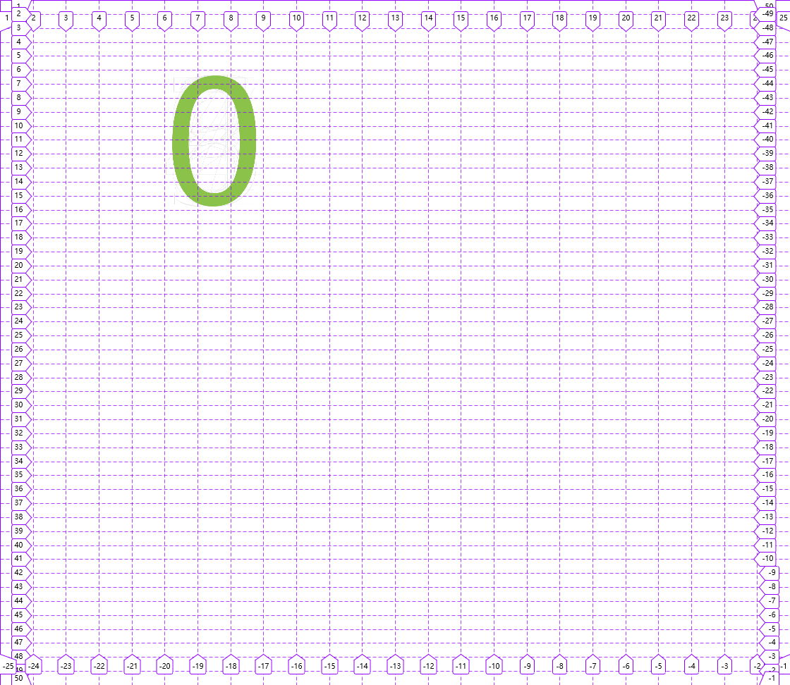

# 1.坐标器

- 为坐标系统提供坐标系, 以便于后续使用提供的坐标器进行定位

## 1.1 &lt;ha-coordinater>

- **简介**：

  使用该组件提供坐标系

- **props**:

  - grid:

    1. 值为一个二维数组, 默认为`[[0, 0, 0]]`, 例如设置为:
   
      ```js
        [[1180, 50, 50]  , [580, 25, 50]]
      ```

    2. 该数组第一维的`length`表示该组件总共拥有多少个坐标系,第二维则表示相对应的坐标系的情况,从左到右三个数分别表示:

      ```js
      [在网页可视宽度大于该值时使用此坐标系, 该坐标系的X轴等分值+1, 该坐标系的Y轴等分值+1]
      ```

    ::: tip 
    例如`[[1180, 50, 50], [580, 25, 50]]`, 该数组的`length`为2表明该组件总共有2个坐标系，表示在网页可视宽度大于`1180px`时使用第一个坐标系`[1180, 50, 50]`,该坐标系的X轴被分为`50等分`,Y轴也被分为`50等分`,在网页可视宽度大于`580px`并且小于`1180px`时使用第二个坐标系`[580, 25, 50]`,该坐标系的X轴被分为`24等分`,Y轴则被分为`49等分`
    :::

- **示例**:

``` html
<ha-coordinater :grid="[[1180, 50, 50], [580, 25, 50]]">
  ...
  这里一般放置容器用来布局(容器一般有可以设置坐标的名为coor的prop)
  ...
</ha-coordinater>
```

- **实例**:

``` html
<ha-coordinater :grid="[[1180, 50, 50], [580, 25, 50]]">
  <ha-rectangle :coor="[[[6,8], [5,8]], [[5,3], [5, 15]]]">
    <ha-number :num="0" color="blue"></ha-number>
  </ha-rectangle>
</ha-coordinater>
```

结果:
  - 当可视宽度大于1180px时为:


  - 当可视宽度大于580px并小于1180px时为:
  


