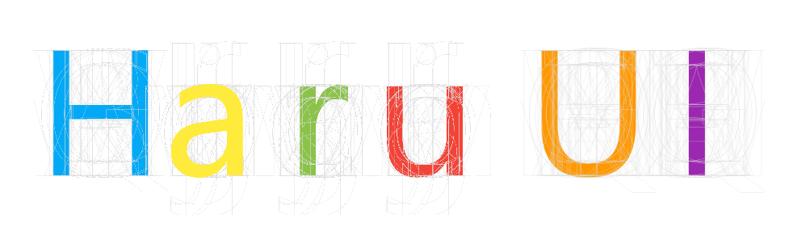

# Haru UI

_**一个实验性质的组件库**_



## 简介及特点

- 名为“Haru UI”的组件库
- 实现了类似"坐标系统"的坐标器
- 使用grid和flex布局实现自适应
- 颜色可高度自定义
- 物料 = 容器 + 填充物
- 应用 = 坐标系 + 容器 + 填充物 = 坐标系 + 物料

---

## 安装

```js
npm install haru-ui --save
```

- **全局**

```js
import Haru from 'haru-ui'

Vue.use(Haru)
```

:::warning 注意
1. 全局引入并不会引入HaIcons和HaCharts
2. 要使用HaIcons，请参照[**HaIcons**](../icons/README.md)
3. 要使用HaCharts，请参照[**HaCharts**](../charts/README.md)
:::

- **单组件按需引入**

:::danger 警告
1. 单组件引入时引用的是源码， 故在打包时需要支持`vue`和`sass`，以及`vue`的`jsx`语法的编译
2. 本组件库使用`webpack`打包编译
:::

```js
import 'haru-ui/style' //导入样式表

// 导入各个组件，组件名[类目]如下表所示
import 组件名(PascalCase) from 'haru-ui/lib/components/类目/组件名(kebab-case)' 

Vue.use(组件名(PascalCase))
```


|组件名[类目]|组件名[类目]|组件名[类目]|
|-------:|:-------:|:-------|
|[**HaCoordinater[coordinater]**](./coordinater/README.md#_1-1-ha-coordinater)|[**HaRectangle[containers]**](./containers/README.md#_2-1-ha-rectangle)|[**HaCard[containers]**](./containers/README.md#_2-2-ha-card)|
|[**HaButton[struffings]**](./stuffings/README.md#_3-1-ha-button)|[**HaAvatar[struffings]**](./stuffings/README.md#_3-4-ha-avatar)|[**HaCheck[struffings]**](./stuffings/README.md#_3-7-ha-check)|
|[**HaNumber[struffings]**](./stuffings/README.md#_3-2-ha-number)|[**HaLetter[struffings]**](./stuffings/README.md#_3-3-ha-letter)|[**HaBack[struffings]**](./stuffings/README.md#_3-5-ha-back)|
|[**HaPage[struffings]**](./stuffings/README.md#_3-6-ha-page)|[**HaTable[materials]**](./materials/README.md#_4-4-ha-table)|[**HaMenuVer[materials]**](./materials/README.md#_4-1-ha-menu-ver)|
|[**HaMenuHor[materials]**](./materials/README.md#_4-2-ha-menu-hor)|[**HaInput[materials]**](./materials/README.md#_4-3-ha-input)|[**HaNotify[others]**](./others/README.md#_5-5-haru-notify)|
|[**HaTooltip[others]**](./others/README.md#_5-3-ha-tooltip)|[**HaScroll[others]**](./others/README.md#_5-2-ha-scroll)|[**HaMask[others]**](./others/README.md#_5-1-ha-mask)|
|[**HaDetailBox[others]**](./others/README.md#_5-4-ha-detailbox)|

- **特别的，还有:** [**HaIcons**](./icons/README.md), [**HaCharts**](../charts/README.md)

::: warning 注意

本组件库未经严格测试, 只作为为实验"坐标系统"的概念在前端中的应用所产生的组件库,如果要使用请自行测试.同时有bug的话也欢迎提交[issues](https://github.com/HydrousDelta/Haru-UI/issues)

:::
---
