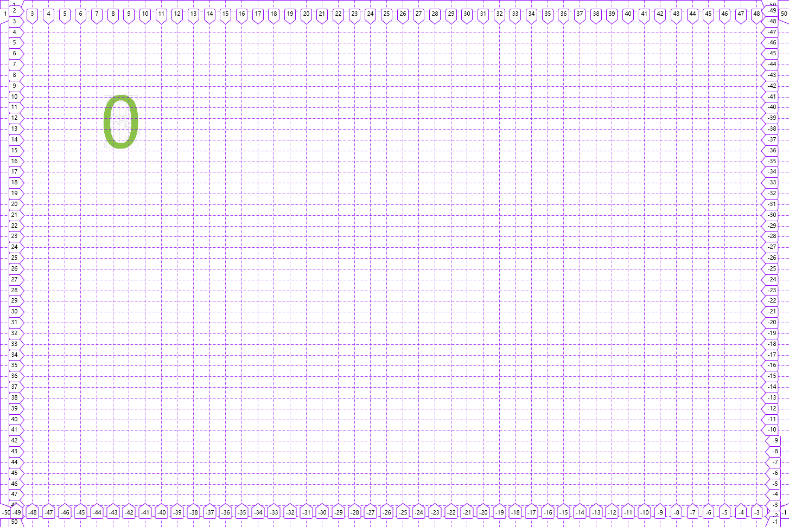

**目录**
* [Haru UI](#haru-ui)
  * [0\. 全局](#0-%E5%85%A8%E5%B1%80)
    * [0\.1 颜色](#01-%E9%A2%9C%E8%89%B2)
    * [0\.2 图标](#02-%E5%9B%BE%E6%A0%87)
  * [1\.坐标器](#1%E5%9D%90%E6%A0%87%E5%99%A8)
    * [1\.1 &lt;ha\-coordinater&gt;](#11-ha-coordinater)
  * [2\.容器](#2%E5%AE%B9%E5%99%A8)
    * [2\.1 &lt;ha\-rectangle&gt;](#21-ha-rectangle)
    * [2\.2 &lt;ha\-card&gt;](#22-ha-card)
  * [3\. 填充物](#3-%E5%A1%AB%E5%85%85%E7%89%A9)
    * [3\.1 &lt;ha\-button&gt;](#31-ha-button)
    * [3\.2 &lt;ha\-number&gt;](#32-ha-number)
    * [3\.3 &lt;ha\-letter&gt;](#33-ha-letter)
    * [3\.4 &lt;ha\-avatar&gt;](#34-ha-avatar)
    * [3\.5 &lt;ha\-back&gt;](#35-ha-back)
    * [3\.6 &lt;ha\-page&gt;](#36-ha-page)
    * [3\.7 &lt;ha\-check&gt;](#37-ha-check)
  * [4\. 物料](#4-%E7%89%A9%E6%96%99)
    * [4\.1 &lt;ha\-menu\-vertical&gt;](#41-ha-menu-vertical)
    * [4\.2 &lt;ha\-menu\-horizontal&gt;](#42-ha-menu-horizontal)
    * [4\.3 &lt;ha\-input&gt;](#43-ha-input)
    * [4\.4 &lt;ha\-table&gt;](#44-ha-table)
  * [5\. 其他](#5-%E5%85%B6%E4%BB%96)
    * [5\.1 &lt;ha\-mask&gt;](#51-ha-mask)
    * [5\.2 &lt;ha\-scroll&gt;](#52-ha-scroll)
    * [5\.3 &lt;ha\-tooltip&gt;](#53-ha-tooltip)
    * [5\.4 $haru\.notify()](#54-harunotify)


# Haru UI

## 0. 全局

### 0.1 颜色

- 简介

  - 16进制颜色值

  ```js
  wihte: '#ffffff',
  black: '#000000',
  green: '#8BC34A',
  lightGreen: '#DCEDC8',
  darkGreen: '#689F38',
  accentGreen: '#4CAF50',
  blue: '#03A9F4',
  lightBlue: '#B3E5FC',
  darkBlue: '#0288D1',
  accentBlue: '#448AFF',
  red: '#F44336',
  lightRed: '#FFCDD2',
  darkRed: '#D32F2F',
  accentRed: '#FF4081',
  yellow: '#FFEB3B',
  lightYellow: '#FFF9C4',
  darkYellow: '#FBC02D',
  accentYellow: '#FF9800',
  orange: '#FF9800',
  lightOrange: '#FFE0B2',
  darkOrange: '#F57C00',
  accentOrange: '#FFC107',
  purple: '#9C27B0',
  lightPurple: '#E1BEE7',
  darkPurple: '#7B1FA2',
  accentPurple: '#7C4DFF',
  grey: '#9E9E9E',
  lightGrey: '#F5F5F5',
  darkGrey: '#616161',
  accentGrey: '#607D8B'
  ```
  
  - 颜色所代表的类名
  
  ```js
  wihte: 'ha-color-white',
  black: 'ha-color-black',
  green: 'ha-color-green',
  lightGreen: 'ha-color-lightGreen',
  darkGreen: 'ha-color-darkGreen',
  accentGreen: 'ha-color-accentGreen',
  blue: 'ha-color-blue',
  lightBlue: 'ha-color-lightBlue',
  darkBlue: 'ha-color-darkBlue',
  accentBlue: 'ha-color-accentBlue',
  red: 'ha-color-red',
  lightRed: 'ha-color-lightRed',
  darkRed: 'ha-color-darkRed',
  accentRed: 'ha-color-accentRed',
  yellow: 'ha-color-yellow',
  lightYellow: 'ha-color-lightYellow',
  darkYellow: 'ha-color-darkYellow',
  accentYellow: 'ha-color-accentYellow',
  orange: 'ha-color-orange',
  lightOrange: 'ha-color-lightOrange',
  darkOrange: 'ha-color-darkOrange',
  accentOrange: 'ha-color-accentOrange',
  purple: 'ha-color-purple',
  lightPurple: 'ha-color-lightPurple',
  darkPurple: 'ha-color-darkPurple',
  accentPurple: 'ha-color-accentPurple',
  grey: 'ha-color-grey',
  lightGrey: 'ha-color-lightGrey',
  darkGrey: 'ha-color-darkGrey',
  accentGrey: 'ha-color-accentGrey'
  ```

  - 这些颜色来自[Material Palette](www.materialpalette.com)

- 内部原理

  > 如果是名为bgColor的prop, 则会在相应位置设置该dom的类名
  > 如果是名为frontColor的prop, 则会设置相应的dom的名为color的style为对应的16进制颜色值

- 自定义颜色

  > 如果是名为bgColor的prop, 请在相应的位置传入自定义类名, 并在css文件中对该类名进行背景颜色的设置
  > 如果是名为frontColor的prop, 请直接在相应的位置传入自定义的以#开头的16进制颜色值

### 0.2 图标

- TODO

## 1.坐标器

### 1.1 \<ha-coordinater>

- 作用

> 为坐标系统提供坐标系, 以便于后续使用提供的坐标器进行定位

- props:

  - grid:

    > 1. 值为一个二维数组,例如\[[1180, 50, 50], [580, 25, 50]], 默认为[[0, 0, 0]]
    > 2. 该数组第一维的length表示有多少个坐标系,第二维则表示相对应的坐标系的情况,从左到右三个数分别表示:\[在网页可视宽度大于该值时使用此坐标系, 该坐标系的X轴等分值+1, 该坐标系的Y轴等分值+1]
    > 3. 例如\[[1180, 50, 50], [580, 25, 50]],表示在网页可视宽度大于1180px时使用第一个坐标系[1180, 50, 50],该坐标系的X轴被分为50等分,Y轴也被分为50等分,在网页可视宽度大于580px并且小于1180px时使用第二个坐标系[580, 25, 50],该坐标系的X轴被分为24等分,Y轴则被分为49等分

- 示例:

``` html

<ha-coordinater :grid="[[1180, 50, 50], [580, 25, 50]]">
  ...
  ...
  这里一般放置容器用来布局(容器一般有可以设置坐标的名为coor的prop)
  ...
  ...
<ha-coordinater>

```

- 实例:

``` html

<ha-coordinater :grid="[[1180, 50, 50], [580, 25, 50]]">
  <ha-rectangle :coor="[[[6,8], [5,8]], [[5,3], [5, 15]]]">
    <ha-number :num="0" color="blue"></ha-number>
  </ha-rectangle>
<ha-coordinater>

```

- 当可视宽度大于1180px时结果为:



- 当可视宽度大于580px并小于1180px时结果为:


## 2.容器

### 2.1 \<ha-rectangle>

- 作用

  > 为填充物提供布局和定位

- props:

  - coor:

    > 1. 值为一个三维数组, 例如[[[4,4], [42,42]], [[3,3], [19, 44]]], 默认为[[[1, 1], [1, 1]]]
    >
    > 2. 该三维数组第一维的length表示该组件可用坐标的个数, 理论上应跟距离该组件最近的父级\<ha-coordinater>的名为grid的prop的第一维length相同,即"容器的坐标个数应与坐标器的坐标系个数一致".
    > 3. 该三维数组的第二维有两个一维的数组,第一个表示坐标[x, y], 原点在左上角, 第二个表示[x轴上的长度(即该容器跨越多少的grid-column线), y轴上的长度(即该容器跨越多少的grid-row线) ]

    - 为保证该值不影响整个坐标系的正常等分, 此组件的默认grid-column-span为2

  - width:

    > 1. 与css的width相同
    > 2. 该prop默认值为"100%", 正常布局时保持默认即可填充完全整个grid-area的宽度, 如果修改此百分比则会在grid-area的宽度下进行计算: 实际宽度 = grid-area的宽度 * 该百分比值
    > 3. 如果修改为固定长度则grid-area宽度无效, 使用此设定的的宽度, 但是该容器坐标位置不受影响

  - height:

    > 1. 与css的height相同
    > 2. 该prop默认值为"100%", 正常布局时保持默认即可填充完全整个grid-area的高度, 如果修改此百分比则会在grid-area的高度下进行计算: 实际高度 = grid-area的高度 * 该百分比值
    > 3. 如果修改为固定长度则grid-area高度无效, 使用此设定的的高度, 但是该容器坐标位置不受影响

    - 为保证该值不影响整个坐标系的正常等分, 此组件的默认grid-row-span为2

  - styleProp:

    > 1. 理论上支持所有的style属性
    > 2. 默认值为{}, 即空对象
    > 3. 暴露该接口的主要目的在于调整容器的margin和border,
    > 4. 次要目的才是调整其他的style.

  - z: 

    > 1. 与css的z-index一致
    > 2. 默认值为 0
    > 3. 目的是为了在坐标重叠时调整z轴上的前后关系 

  - overflow: 

    > 1. 与css的overflow一致
    > 2. 默认值为hidden, 创建BFC保证容器内的任何内容不影响容器外的内容.

  - haShow:

    > 1. 设置可视宽度(px)大于该值显示此容器
    > 2. 值为Number, 默认为空

- 注: 

  > 此组件的默认position为relative

- 示例

  - TODO

- 实例

  - TODO

### 2.2 \<ha-card>

- 作用: 

  在\<ha-rectangle>的基础上提供垂直和水平的三栏布局

- props:

  - 具有跟\<ha-rectangle>除overflow外一致的props

  - type:

    > 1. 值为"Ver"或者"Hor", 默认为"Ver"
    >
    > 2. 为"Ver"时为垂直的三栏容器, 为"Hor"时为水平的三栏容器

  - hcfHeight:

    > 1. 当名为type的prop为"Vet"时有效
    > 2. 值为一个length为3的一维数组, 默认为['0%', '100%', '0%']
    > 3. 该数组表示[头部名为header的slot的高度, 中间名为content的slot的高度, 底部名为footer的slot的高度]

  - lmrWidth:

    > 1. 当名为type的prop为"Hor"时有效
    > 2. 值为一个length为3的一维数组, 默认为['0%', '100%', '0%']
    > 3. 该数组表示[左边名为left的slot的宽度, 中间名为middle的slot的宽度, 右边名为right的slot的宽度]

  - bgColor: 

    > 1. 值为一个length为3的一维数组, 例如['blue', 'lightBlue', 'accentBlue'], 分别表示['header或者left的颜色', content或者middle的颜色, footer或者right的颜色]
    > 2. 默认为'', 即空

- slots: 

  - 当名为type的prop的值为"Ver"时具有header, content, footer的具名插槽, 并且有一个跟content同位置的匿名插槽
  - 当名为type的prop的值为"Hor"时具有left, middle, right的具名插槽, 并且有一个跟middle同位置的匿名插槽

- 注: 

  > 此组件的默认position为relative

- 示例

  - TODO

- 实例

  - TODO

## 3. 填充物

- 所有stuffings的默认宽高均为100%, 使用时请给予包裹一个具有宽度和高度的容器, 例如\<ha-rectangle>

### 3.1 \<ha-button>

- props:

  - icon:

    > 1. button的icon
    > 2. 值为表示路径的字符串, 默认为空

  - title: 

    > 1. button的标题
    > 2. 值为字符串, 默认为空

  - disabled: 

    > 1. 是否禁用button
    > 2. 值为布尔值, 默认为false

  - fontSize:

    > 1. 设置按钮的文字大小
    > 2. 与css的font-size一致

  - bgColor:

    > 1. button的颜色
    > 2. 值为表示颜色的字符串, 默认为空

- events:

  - click:

    > 1. 当button被点击时触发
    > 2. 无传递参数

### 3.2 \<ha-number>

- props:

  - num:

    > 1. 要显示的数字
    > 2. 值为Number, 并且为在0 - 9 范围内的个位数, 默认为0

  - dot:

    > 1. 是否显示小数点
    > 2. 值为布尔值, 默认为false

  - frontColor:

    > 1. 设置所显示数字的颜色
    > 2. 值为表示颜色的String, 默认为空

### 3.3 \<ha-letter>

- props:

  - capital:

    > 1. 是否大写
    > 2. 值为Boolean, 默认为false

  - letter:

    > 1. 要显示的字母
    > 2. 值为String, 并且为在[a - z] | [A - Z] 范围内的个位数, 默认为a

  - frontColor:

    > 1. 设置所显示字母的颜色
    > 2. 值为表示颜色的String, 默认为空

### 3.4 \<ha-avatar>

- props:

  - url:

    > 1. 要显示的图像的url
    > 2. 值为String, 默认为空

  - alt

    > 1. 未显示图像时显示的文字
    > 2. 值为String, 默认为空

### 3.5 \<ha-back>

- props:

  - title:

    > 1. 要显示的标题
    > 2. 值为String, 默认为空

  - bgColor:

    > 1. 设置背景颜色
    > 2. 值为表示颜色的String, 默认为空

### 3.6 \<ha-page>

- props: 

  - page:

    > 1. 总页数
    > 2. 值为Number, 默认为1

### 3.7 \<ha-check>

- props:

  - isCheck:

    > 1. 初始时是否为checked
    > 2. 值为Boolean, 默认为false

  - content

    > 1. 该check的内容
    > 2. 值为String, 默认为空

  - bgColor:

    > 1. 设置选框的颜色
    > 2. 值为String, 默认为空

- events:

  - checked:

    > 1. 当选框被点击时触发
    >
    > 2. 传递的参数为一个对象, 该对象如下
    >
    >    ```js
    >    {
    >      isCheck: 当前选框是否选中, 值为Boolean, 
    >      content:  与名为content的值一致
    >    }
    >    ```
    >
    >    

- 注: 

  > 1. 名为isCheck的prop只做初始化时使用
  > 2. 触发checked事件是并不会改变父组件传递进来的绑定于名为isCheck的prop的值, 请根据事件传递的参数对象中的isCheck值进行判断

## 4. 物料

### 4.1 \<ha-menu-vertical>

- 简介

  > 1. 一个垂直的菜单

- props:

  - 具有跟\<ha-rectangle>除overflow外一致的props

  - singleOpen:

    > 1. 是否在打开一个子菜单时关闭其他同级的子菜单
    > 2. 值为Boolean, 默认为false

  - menuList:

    > 1. 该菜单要显示的内容对象
    >
    > 2. 值为一个具有树状结构的对象, 默认为空对象{}
    >
    > 3. 该对象由两种对象组成,一种的表示子菜单的对象, 一种是表示item的对象
    >
    > 4. 子菜单对象示例: 
    >
    >    ```js
    >    {
    >      menuTitle: '该子菜单的标题',
    >      menuList: [一个由子菜单对象或item对象组成的数组],
    >      icon: '一个表示图标的url'
    >    }
    >    ```
    >
    > 5. item对象示例:
    >
    >    ```js
    >    {
    >      title: 'item的标题',
    >      route: '点击时的vue-router的跳转路由',
    >      icon: '一个表示图标的url'
    >    }
    >    ```
    >
    > 6. 该对象的数据结构示例如下:
    >
    >    ```js
    >    {
    >      menuTitle: 'ha-menu-vertical-title',
    >      menuList: [
    >        {
    >          groupId: '1',
    >          menuTitle: 'groupTitle',
    >          icon: '一个表示图标的url',
    >          menuList: [
    >            {
    >              groupId: '2',
    >              menuTitle: 'g2',
    >              menuList: [
    >                {
    >                  title: 'list1',
    >                  route: '/list1',
    >                  icon: '一个表示图标的url'
    >                },
    >                {
    >                  title: 'list1',
    >                  route: '/list1'
    >                  icon: '一个表示图标的url'
    >                },
    >                {
    >                  title: 'list1',
    >                  route: '/list1'
    >                },
    >                {
    >                  title: 'list1',
    >                  route: '/list1'
    >                },
    >              ] 
    >            },
    >            {
    >              groupId: '3',
    >              menuTitle: 'g3',
    >              icon: '一个表示图标的url',
    >              menuList: [
    >                {
    >                  title: 'list1',
    >                  route: '/list1'
    >                },
    >                {
    >                  title: 'list1',
    >                  route: '/list1'
    >                },
    >                {
    >                  title: 'list1',
    >                  route: '/list1'
    >                },
    >                {
    >                  title: 'list1',
    >                  route: '/list1'
    >                },
    >              ] 
    >            }
    >          ]
    >        }
    >      ]
    >    }
    >    ```
    >

  - bgColor: 

    > 1. 表示子菜单和item的颜色
    > 2. 值为一个length为2的数组, 分别表示[group的背景颜色, item的背景颜色], 默认值为空

### 4.2 \<ha-menu-horizontal>

- 简介:

  > 1. 一个水平表示的菜单

- props:

  - 与\<ha-menu-vertical>具有一致的props

### 4.3 \<ha-input>

- 简介:

  > 1. 一个有错误提示的输入框

- props:

  - 具有跟\<ha-rectangle>除overflow外一致的props

  - type:

    > 1. 表示输入框的类型
    > 2. 值为String, 默认为'text'
    > 3. 不能为'file'

  - value: 

    > 1. 该输入框的值
    > 2. 值为String, 默认为空
    > 3. 支持v-model

  - labe

    > 1. 表示该输入框的lable
    > 2. 值为String, 默认为空

  - name:

    > 1. 该输入框的名字, 为lable和input的for属性使用
    > 2. 值为String, 默认为空

  - bgColor:

    > 1. 设置默认背景颜色
    > 2. 值为表示颜色的String, 默认为空

  - checkFun:

    > 1. 一个检验value的函数,
    >
    > 2. 值为Function, 默认为
    >
    >    ```js
    >    function(val) {
    >      return {
    >        msg: '',
    >        bgColor: this.bgColor
    >      }
    >    }
    >    ```
    >
    > 3. 该函数返回一个对象:
    >
    >    ```js
    >    {
    >      msg: '一个提示的字符串',
    >      bgColor: '提示时的背景颜色'
    >    }
    >    ```

### 4.4 \<ha-table>

- 简介: 

  > 1. 一个具有base和advance两种状态的表格

- props:

  - 具有跟\<ha-rectangle>除overflow外一致的props

  - type: 

    > 1. 设置类型为base或者advance
    > 2. 值为base或者advance, 默认为base

  - datas:

    > 1. 表格的数据
    >
    > 2. 值为一个对象, 示例如下
    >
    >    ```js
    >    {
    >      head:  ['列一','列二','列三','列四', '列5','列6','列7','列8','列9'], // 表头，
    >      rows: [ 
    >        {
    >          bgColor: 'blue', // 设置该行颜色,如果名为type的prop值为base, bgColor无效
    >          row: [1,'这是ha-table的一个单元格',3,4,5,6,7,8,9]
    >        }, 
    >        {
    >          bgColor: 'red',// 设置该行颜色,如果名为type的prop值为base, bgColor无效
    >          row: [{
    >            data: 1,
    >            bgColor: 'yellow'// 设置该单元格颜色,如果名为type的prop值为base, 则无效
    >          },2,3,4,5]
    >        }, 
    >        [1,2,3,4,5], 
    >        [1,2,3,4,5], 
    >        [{
    >          data: 0,
    >          bgColor: 'blue'
    >        },0,0,0],
    >        [0,0,0,0],
    >        [0,0,0,0],
    >        [0,0,0,0],
    >        [0,0,0,0],
    >        [0,0,0,0],
    >        [0,0,0,0],
    >        [0,0,0,0],
    >        [0,0,0,0],
    >        [0,0,0,0],
    >        [0,0,0,0],
    >        [0,0,0,0],
    >        [0,0,0,0],
    >        [0,0,0,0],
    >        [0,0,0,0],
    >        [0,0,0,0],
    >        [0,0,0,0],
    >        [0,0,0,0],
    >        [0,0,0,0],
    >        [0,0,0,0],
    >        [0,0,0,0],
    >        [0,0,0,0]
    >      ]
    >    }
    >    ```
    >
    >    

  - perPage:

    > 1. 如果名为type的prop值为base, 该prop无效
    > 2. 设置每页展示的行数
    > 3.  值为Number, 默认为10

  - colNoShow:

    > 1. 如果名为type的prop值为base, 该prop无效
    > 2. 设置初始化时不展示的列
    > 3. 值为一个一维数组, 数组的每个元素为名为datas的prop的对象的head里面之一, 默认为空

  - bgColor:

    > 1. 设置颜色
    > 2. 值为一个length为3的数组, 分别表示[表头的颜色, 除去表头行数为奇数的行的颜色,  除去表头行数为偶数的行的颜色], 默认为空

- events:

  - pageError:

    > 1. 当名为type的prop为advance时有效
    > 2. 当页面输入框输入数字跳转时, 该数字小于或大于总页数时触发
    > 3. 传递的参数为输入的数字字符串

## 5. 其他

### 5.1 \<ha-mask>

- 简介

  > 遮罩组件

- props:

  - show:

    > 1. 设置遮罩是否显示
    > 2. 值为Boolean, 默认为false

  - position:

    > 1. 与css的position一致
    > 2. 默认为fixed, 如果要在容器中使用, 可设置为absolute

  - duration:

    > 1. 设置此遮罩多少毫秒后自动消失
    > 2. 值为Number, 默认为0

  - clickHide:

    > 1. 设置点击遮罩是否隐藏
    > 2. 值为Boolean, 默认为false

- 注: 

  > 1. 此组件的宽度和高度默认100%
  > 2. 在绑定此组件的show时应使用.sync修饰, 达到该组件内的show和外部传递进来的值保持一致

### 5.2 \<ha-scroll>

- 简介:

  > 滚动条

- props:

  - toBottom:

    > 1. 设置到达低部的标识是否显示
    > 2. 值为Boolean, 默认为false

  - toTop:

    > 1. 设置到达顶部的标识是否显示
    > 2. 值为Boolean, 默认为false

  - bgColor:

    > 1. 设置颜色
    > 2. 值为一个length为4的数组, 分别表示[Y方向滚动条颜色, X方向滚动条的颜色, toBottom的颜色, toTop的颜色], 默认为空

- 注:

  > 1. 此组件的默认高度和宽度为100%

### 5.3 \<ha-tooltip>

- 简介:

  > 提示信息

- props:

  - tip:

    > 1. 设置要显示的提示信息
    > 2. 值为String, 默认为空

  - wait:

    > 1. 设置鼠标放置后需要多少毫秒才显示tip
    > 2. 值为Number, 默认为3000

  - location:

    > 1. 设置显示信息的位置
    > 2. 值为top或者bottom

- 注:

  > 1. 此组件的默认高度和宽度为100%

### 5.4 $haru.notify()

- 简介:

  > 显示通知

- 使用方法:

  > 1. 组件直接调用(this.)$haru.notify(vm, options)
  >
  > 2. 参数vm为一个vue实例, 通知组件将挂载到此实例的$root.$el上, 建议直接传入调用时的所在组件实例, 即this
  >
  > 3. 参数options为一个对象, 示例如下:
  >
  >    ```js
  >    {
  >      msg: '这是一个haru UI的通知', // 要显示的通知信息, 默认为空
  >      duration: 4000, // 多少毫秒后该通知消失,默认为4000
  >
  >      //显示位置,('topRight'|'bottomRight'|'topLeft'|
  >      //'bottomLeft'|'topMiddle'|'bottomMiddle')的其中之一
  >      // 默认为'topRight'
  >      location: 'topRight', 
  >
  >      bgColor: 'lightBlue',// 设置背景颜色, 默认为空
  >      icon: require('@icons/信息.svg') // 设置要显示的icon, 默认为欸空
  >    }
  >    ```

[^_^]:
    ### 5.5 $haru.icons
    
    ### 5.6 $haru.colors


