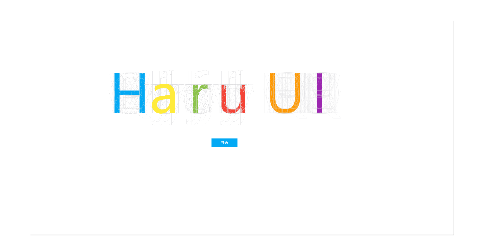

# Haru UI

_**一个实验性质的组件库**_

   

<!--  -->

## 简介

- 名为“Haru UI”的组件库
- [文档](https://hydrousdelta.github.io/Haru-UI)在这里
<!-- - [sample]()在这里 -->

## 特点

- 实现了类似"坐标系统"的坐标器
- 使用grid和flex布局实现自适应
- 颜色可高度自定义
- 物料 = 容器 + 填充物
- 应用 = 坐标系 + 容器 + 填充物 = 坐标系 + 物料

---

## 安装

```js
npm install haru-ui --save
```

- 全局

```js
import Haru from 'haru-ui'

Vue.use(Haru)
```

- 单组件引入

```js
import 'haru-ui/style' //导入样式表

import { HaCoordinater } from 'haru-ui' // 导入各个组件

Vue.use(HaCoordinater)
```

## 注意

> 本组件库未经严格测试, 只作为为实验"坐标系统"的概念在前端中的应用所产生的组件库,如果要使用请自行测试.同时有bug的话也欢迎提交[issues](https://github.com/HydrousDelta/Haru-UI/issues)

---

